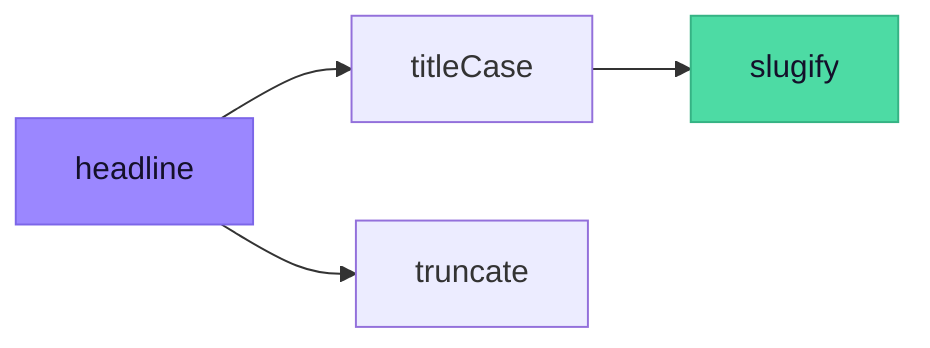
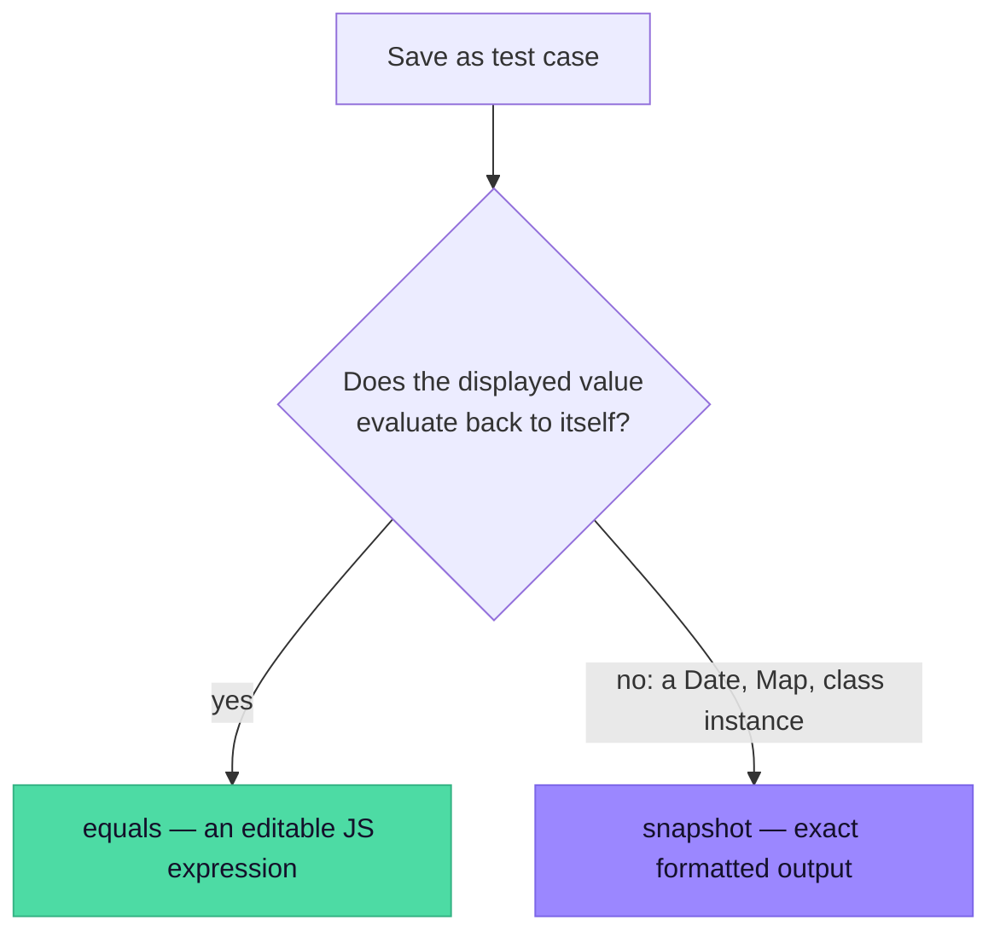
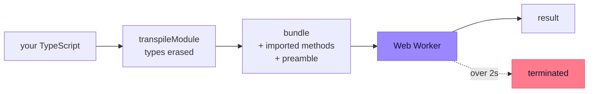

<div align="center">

# TS Sandbox

**A local scratchpad for TypeScript methods.**
Write a function, run it against real inputs, capture the result as a test — without leaving the browser.

No server · no network · no build step · everything in `localStorage`

</div>

---

```bash
npm install
npm run dev     # → http://localhost:5180
```

That's it. The bundled examples load on first run, so there's something to poke at immediately.

---

## Contents

| | |
| --- | --- |
| [The interface](#the-interface) | What's on screen and where |
| [Writing methods](#writing-methods) | Imports between methods, the shared preamble |
| [Running](#running) | Arguments, errors that point at your code, history |
| [Testing](#testing) | Matchers, diffs, capturing a result |
| [Export & import](#export--import) | `.ts` files, workspace backups, Vitest |
| [How it runs your code](#how-it-runs-your-code) | The pipeline, and why it's safe |
| [Keyboard](#keyboard) | Shortcuts |
| [Project layout](#project-layout) | Where things live |
| [Known limits](#known-limits) | What it doesn't do |

---

## The interface

```
┌──────────────────────────────────────────────────────────────────────────────┐
│  ▶] TS Sandbox   ● saved just now      ▶ Run all tests   Export ▾    ⋯    ⚙  │
├──────────────┬──────────────────────────────────────┊───────────────────────┤
│ Search…      │ slugify   Turn a title into a slug   ┊  Run  │  Tests 3    ✕ │
│ + New method │ [strings ×] [text ×] + tag           ┊ ──────────────────────│
│              │ ┌──────────────────────────────────┐ ┊  ARGUMENTS            │
│ ⠿ slugify    │ │ 1  export function slugify(      │ ┊  title   "Hello!"     │
│   3 tests ✓  │ │ 2    title: string               │ ┊                       │
│              │ │ 3  ): string {                   │ ┊  ▶ Run  Save as test  │
│   truncate   │ │ 4    return title                │ ┊ ──────────────────────│
│   4 tests ✓  │ │ 5      .trim()                   │ ┊  RETURNED  string     │
│              │ │ 6      .toLowerCase()            │ ┊  "hello"              │
│   titleCase  │ │ 7  }                             │ ┊                       │
│   1 test  ✓  │ └──────────────────────────────────┘ ┊  ▸ History (3)        │
│              │                                      ┊                       │
│ ⚙ Preamble   │              editor            drag ─┊─ to resize            │
└──────────────┴──────────────────────────────────────┊───────────────────────┘
     library                                        splitter      results
```

- **Library** — searchable, taggable, and **drag rows to reorder**. A red dot marks a method with type errors.
- **Editor** — Monaco, with full TypeScript language support.
- **Splitter** — drag to resize, double-click to reset. The **✕** hides the panel; a slim rail brings it back.

---

## Writing methods

### Methods can import each other

`import { slugify } from "./slugify"` resolves against the workspace **by method name**, and dependencies compile in order:



Types flow across those imports, because every method is registered with the editor — not just the one on screen. Call an imported method with the wrong argument type and you are told at the call site.

| Problem | What you see |
| --- | --- |
| Wrong argument type | `Argument of type 'number' is not assignable to parameter of type 'string'` |
| No such method | `Cannot find module './nope'` |
| Circular imports | `Import cycle: cycleA → cycleB → cycleA` |

> `import type { … }` is erased at compile time, so it is not a runtime dependency — type-only cycles are allowed, exactly as TypeScript allows them.

### The shared preamble

One workspace-level file of types and helpers, prepended to every method and visible to every editor. Open it from the bottom of the sidebar.

```ts
export type Result<T> = { ok: true; value: T } | { ok: false; error: string };
export function ok<T>(value: T): Result<T> { return { ok: true, value }; }
export function err<T = never>(error: string): Result<T> { return { ok: false, error }; }
```

If you have never edited it, it is carried forward automatically when the bundled default gains new helpers. **Once you edit it, it is yours and is never overwritten.**

---

## Running

Arguments get **one input per parameter**, labelled with the parameter's real name. Switch to `raw` for a plain array when you need spreads or rest parameters.

Values are **JavaScript expressions, not JSON**, so all of these work:

```js
new Date(0)          // a real Date
/^\d+$/              // a regex
async () => "hi"     // an inline callback
```

### Errors point at your code

Stack frames are mapped back through source maps, so you get your own line numbers — and the location is clickable, which jumps the editor there and flashes the line.

```
Error: size must be greater than 0
    at chunk (chunk.ts:2:24)      ← your source, not generated output
```

### History

The last 10 runs per method are kept, with the arguments used. Runs made before an edit are marked *code changed*, so you can tell what is still current.

---

## Testing

Test cases live with the method. Each has its own arguments and a matcher:

| Matcher | Passes when |
| --- | --- |
| `equals` | the return value deep-equals the expected expression |
| `throws` | it throws, and the message contains the given text |
| `truthy` | the return value is truthy |
| `runs` | nothing throws |
| `snapshot` | the formatted output matches exactly |

`equals` compares **structurally**: `NaN` equals `NaN`, `-0` is distinct from `0`, and Dates, RegExps, Maps and Sets compare by content rather than identity.

### Failures show you the difference

Rather than dumping two large objects side by side, a failure reports the **first differing path**:

```
FIRST DIFFERENCE  items[2].name
  expected   "hello-typescript-planet"
  received   "hello-typescript-world"
                              └─ only the differing span is highlighted
```

### Capturing a result

Run a method, check the output, press **Save as test case**. The matcher is chosen for you:



That check is a real round-trip rather than a guess by type, so capture works for **any** return value instead of silently writing an expectation that cannot parse.

---

## Export & import

| | Scope | Round-trips? |
| --- | --- | --- |
| **This method (`.ts`)** | code, tests, tags, settings | ✅ lossless |
| **Whole workspace (`.json`)** | every method + preamble | ✅ your backup |
| **Tests → Vitest** | one method's enabled cases | ➡️ one-way |

A `.ts` export is a **real TypeScript file** — the description becomes JSDoc, your code is the file body, and a trailing comment carries everything else:

```ts
/**
 * Shorten text to a maximum length.
 */
export function truncate(text: string, max: number, suffix = "…"): string { … }

/* @sandbox — ts-sandbox metadata; delete this block and the file still compiles
{ "tags": ["strings"], "tests": [ … ] }
*/
```

`tsc` ignores that comment, so the file drops straight into a repo — but importing it back here restores the method whole.

<details>
<summary><b>Import details</b></summary>

<br>

- A `.json` workspace merges its methods in; several files at once is fine.
- A `.ts` file written by this app comes back complete.
- **Any other `.ts` file** imports too — the name comes from the exported function, and a plain prose JSDoc becomes the description. A comment carrying `@param`/`@returns` is real API documentation, so it stays in the code.
- Names are de-duplicated (`slugify` → `slugify2`), which matters because a method's name *is* its import specifier.
- **Importing never destroys your preamble.** If yours is untouched it adopts theirs; otherwise yours is kept and the toast offers to swap — undoably.
- **Add examples** tops up your library with bundled examples you do not already have, leaving your own work alone.

</details>

---

## How it runs your code



Types are **erased, not checked** — a type error will not block a run unless you enable *block on type errors* in ⚙. The editor still tells you about it.

One worker is reused across a batch of test cases, so the module graph is parsed once, but **each case gets fresh module state** — nothing leaks between cases. A case that overruns the 2s timeout has its worker terminated, and the next one transparently gets a replacement, so a runaway loop costs one worker rather than the whole run.

Nothing is sent anywhere. `import` of npm packages will not resolve — only other methods in the workspace. Everything the browser provides (`Math`, `JSON`, `fetch`, `setTimeout`, …) is available.

---

## Keyboard

| Shortcut | Does |
| --- | --- |
| <kbd>⌘</kbd>/<kbd>Ctrl</kbd> + <kbd>Enter</kbd> | Run — or run the whole suite, on the Tests tab |
| <kbd>Alt</kbd> + <kbd>↑</kbd> / <kbd>↓</kbd> | Move the focused method up or down |
| <kbd>←</kbd> / <kbd>→</kbd> | Resize, with the splitter focused |
| <kbd>⌥</kbd> + <kbd>F8</kbd> | Jump to the next problem (Monaco) |
| <kbd>⌘</kbd> + <kbd>.</kbd> | Quick fix (Monaco) |

---

## Project layout

```
src/
├── App.tsx                 workspace state, persistence, orchestration
├── components/
│   ├── Sidebar.tsx         library, tags, filtering, drag-to-reorder
│   ├── TopBar.tsx          primary action + export/more/settings menus
│   ├── Splitter.tsx        resizable divider
│   ├── RunPanel.tsx        per-parameter inputs, diagnostics, history
│   ├── TestsPanel.tsx      test editing, results, Vitest export
│   ├── ResultView.tsx      results and difference display
│   ├── Menu.tsx            shared popover
│   ├── SaveIndicator.tsx   makes autosave visible
│   ├── Celebration.tsx     confetti, thrown from its source button
│   ├── CountUp.tsx         rolls a changing number
│   ├── TagEditor.tsx       tag chips
│   └── Toast.tsx           notifications, including undo
└── lib/
    ├── compile.ts          TS → JS + source map, entry/param/import detection
    ├── bundle.ts           resolves cross-method imports into a module graph
    ├── runner.ts           worker session lifecycle, reuse, timeouts
    ├── sandbox.worker.ts   executes code, maps stacks, checks expectations
    ├── sourcemap.ts        minimal source-map reader (VLQ decode)
    ├── inspect.ts          formatting, deep equality, difference finding
    ├── diagnostics.ts      pulls type errors out of Monaco
    ├── codegen.ts          .ts method files and Vitest generation
    ├── storage.ts          localStorage, import/export, seeds
    ├── theme.ts            light/dark/system
    ├── sound.ts            synthesised cues
    └── useBusy.ts          delays busy indicators so fast runs stay calm
```

---

## Known limits

| | |
| --- | --- |
| ⏱️ | The 2s timeout is a constant in `runner.ts`, not a per-method setting. |
| ✏️ | Renaming a method does not rewrite `import` statements in methods that depend on it. |
| 🔍 | Entry-point and parameter detection is pattern-based, so unusual declaration forms may need the `entry` override. |
| 📸 | Snapshot cases export to Vitest as an empty `toMatchInlineSnapshot()` — Vitest fills in its own on first run, since the stored rendering is this app's formatter. |
| 🧪 | The app itself has no test suite yet. Given how much subtle pure logic now lives in `lib/`, this is the most valuable thing left to add. |
